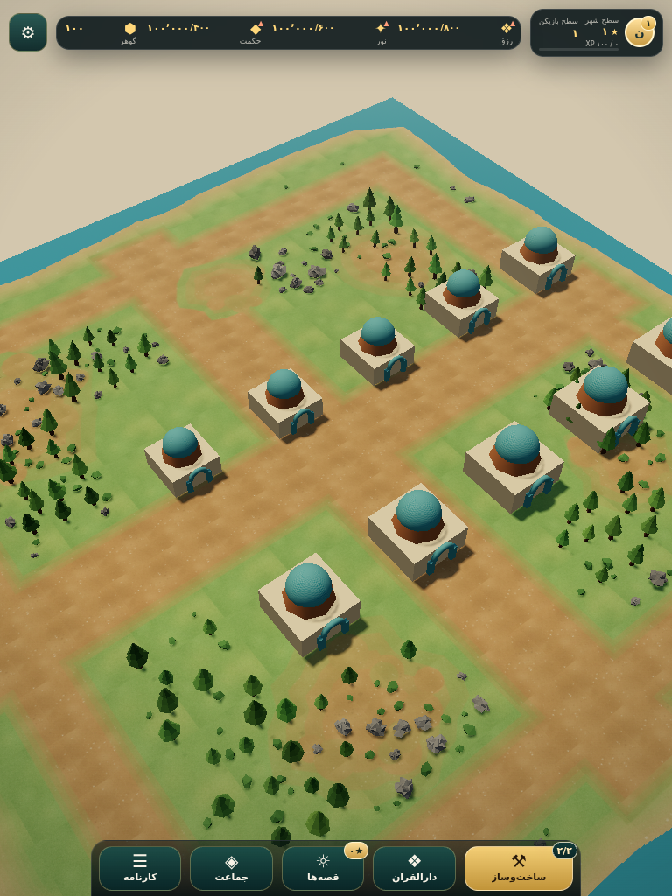
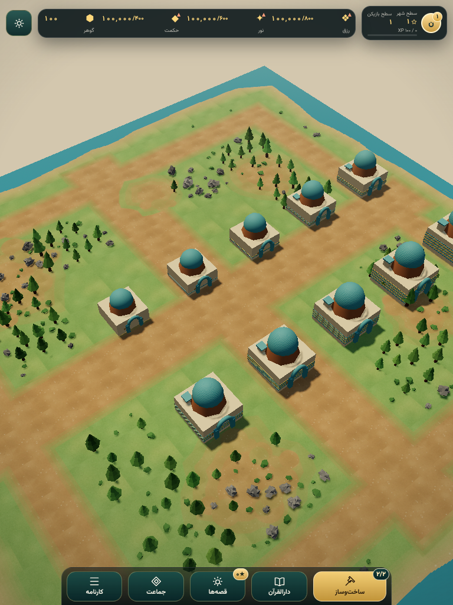
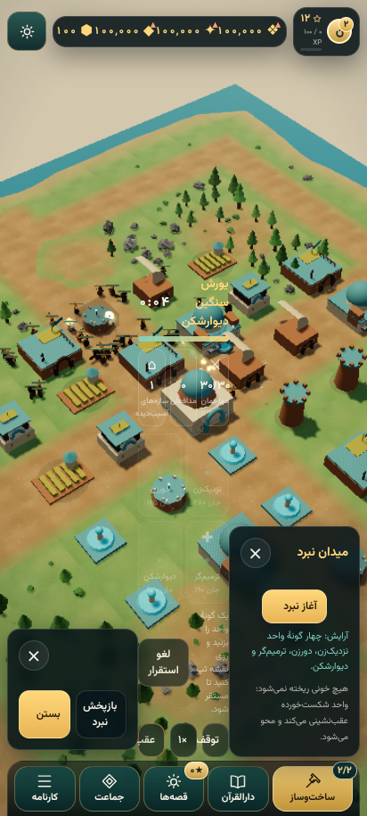

# گزارش ارتقای شهر نور — ۲۰۲۶-۱۰-۰۹

**وضعیت: اصلاح‌های هسته، امنیت و بودجهٔ بار اولیه/رندر انجام شد؛ کل درخواست هنری و تأیید گوشی واقعی هنوز کامل نیست.** این گزارش موارد انجام‌شده را از باقی‌مانده جدا می‌کند. main merge نشده است.

مبنا: `9b64be982aad3dc1fe03652afc048779172fe4b8`. اجرای نهایی: `3db8fe0`. کار و commitهای بخشی روی شاخهٔ ثابت نشست `arena/d474f0aa-quranic-strategy-3d` است؛ به‌جای ایجاد شاخه‌های خارج از نشست، بخش‌ها با commit مستقل و checklist جدا نگه داشته شدند.

## درگاه‌های پذیرش

- npm ci در پایه موفق بود؛ lockfile برای Terser build-only به‌روز شد.
- npm test: **۱۱۲ self-check + ۱۴۲ unit / ۲۲ فایل** سبز (خروجی خام در after/test.txt).
- smoke، build، test:pwa و test:bundle: خروجی خام در after/*.txt؛ bundle graph کامل بررسی می‌شود.
- HUD: **۲۰۱/۲۰۱** در ۶ viewport × دو مقیاس قلم؛ safe-area مصنوعی **۸/۸**. آزمون notch واقعی نیست.
- هر bug واقعی red→fix→green دارد؛ خطاهای harness و هدف‌های هنری تازه به‌عنوان bug پایه شمرده نشدند. فهرست: [BUGS.md](../audit/BUGS.md).

## بار اولیه و انتقال داده

| معیار | قبل | بعد | تعریف |
|---|---:|---:|---|
| JS اولیه gzip | 328.16 kB | 201.65 kB | مجموع همهٔ static imports از manifest، نه فقط entry |
| کاهش در برابر مبنای واقعی | — | 38.55٪ | هدف تاریخی 288.6 جدا نگه داشته شد |
| کاهش در برابر 288.6 تاریخی | — | 30.13٪ | هدف ≤202.02 kB |
| تمام JS شامل lazy gzip | — | 343.38 kB | کاهش کل کد ادعا نمی‌شود؛ [جزئیات](after/bundle.json) |
| دیتاست قرآن روی HTTP با Brotli | 3181959 bytes | 541769 bytes | 82.97٪ کمتر؛ بایت decode‌شده همان فایل اصلی است |

battle، مطالعه/قرآن، جماعت/تنظیمات، campaign، guide و audio تک‌پرواز و on-demand هستند. دادهٔ قرآن پس از idle/تعامل load می‌شود. آموزش/مأموریت ذخیره‌شده پیش از bootstrap logic خود را نصب می‌کند. PWA versioned است و update فعال تا رضایت و **ذخیرهٔ پایدار موفق** منتظر می‌ماند؛ خطای IDB/private mode باعث reload نمی‌شود. میزبان static تولیدی باید Content-Encoding: br را تنظیم کند؛ sidecar در dist ساخته می‌شود و raw+br دوباره precache نمی‌شوند.

## روش اندازه‌گیری و حدود اعتبار

Chromium **153.0.8010.0**، viewport 412×915، DPR دستگاه ۱، ANGLE/SwiftShader نرم‌افزاری، ۲s warmup + ۶s sample، CPU throttle ۱×/۴×. FPS از فاصلهٔ render واقعی؛ p1 = 1000/p99 interval. heap از CDP بعد از GC، **نه VRAM**. calls/triangles همان renderer.info main pass هستند؛ همهٔ shadow passها/کار compositor را شمارش نمی‌کنند. مدل‌های افزوده و سایهٔ صحیح هزینه دارند؛ برتری FPS برای همهٔ حالت‌ها ادعا نمی‌شود. governor فعال است؛ ستون DPR پایان نشان می‌دهد رزولوشن با پایهٔ ثابت یکسان نیست. نبرد از ۳۰ واحد شروع می‌شود؛ تعداد بازماندهٔ پایان هر sample در JSON ثبت است.

اولین اجرای پس از هنر، high battle را کندتر کرد. خروجی نامطلوب حذف نشده: [graphics-first-pass.json](iterations/graphics-first-pass.json). detail maps هنگام افت governor bypass و downscale سریع‌تر شد؛ bug عدم بازیابی در cap واقعی ۶۰Hz هم red→green شد. نوسان/عدم monotonicity CPU4× در SwiftShader دلیل کافی برای ادعای hardware speedup نیست.

## ماتریس قبل/بعد — ۱۸ حالت

| حالت | کیفیت | CPU | mean FPS قبل→بعد | p1 FPS قبل→بعد | mean ms قبل→بعد | calls | triangles | geo/tex | heap MiB | DPR آخر |
|---|---|---|---|---|---|---|---|---|---|---|
| empty | low | 1× | 5.53 → 17.54 | 2.22 → 7.07 | 180.85 → 57.01 | 6 → 6 | 8687 → 8687 | 7/4 → 7/4 | 12.26 → 12.15 | 0.75 |
| city30 | low | 1× | 10.35 → 14.50 | 4.77 → 5.85 | 96.59 → 68.98 | 305 → 66 | 19911 → 22497 | 306/5 → 67/5 | 14.09 → 12.85 | 0.75 |
| battle30 | low | 1× | 6.63 → 7.87 | 2.85 → 1.89 | 150.75 → 127.03 | 316 → 77 | 27129 → 34993 | 320/7 → 81/7 | 14.94 → 13.89 | 0.75 |
| empty | medium | 1× | 6.32 → 9.20 | 3.09 → 2.76 | 158.11 → 108.67 | 6 → 6 | 11372 → 11372 | 7/7 → 7/11 | 12.40 → 12.47 | 0.70 |
| city30 | medium | 1× | 5.08 → 6.80 | 2.64 → 1.76 | 196.86 → 147.15 | 305 → 66 | 22596 → 25182 | 348/8 → 67/14 | 14.28 → 13.28 | 0.70 |
| battle30 | medium | 1× | 4.03 → 4.07 | 1.35 → 1.18 | 247.85 → 245.72 | 316 → 77 | 29408 → 37790 | 362/10 → 81/16 | 15.33 → 14.46 | 0.70 |
| empty | high | 1× | 4.98 → 7.39 | 1.83 → 2.18 | 200.82 → 135.40 | 6 → 6 | 12290 → 12290 | 7/7 → 7/11 | 12.42 → 12.45 | 0.65 |
| city30 | high | 1× | 4.40 → 5.19 | 2.25 → 1.70 | 227.28 → 192.52 | 305 → 66 | 23514 → 26100 | 348/8 → 67/14 | 14.29 → 13.18 | 0.65 |
| battle30 | high | 1× | 3.40 → 3.48 | 1.50 → 1.12 | 294.18 → 287.23 | 316 → 77 | 30078 → 38700 | 362/10 → 81/16 | 15.34 → 14.17 | 0.80 |
| empty | low | 4× | 8.69 → 13.37 | 5.69 → 7.02 | 115.03 → 74.77 | 6 → 6 | 8687 → 8687 | 7/4 → 7/4 | 12.30 → 12.17 | 0.75 |
| city30 | low | 4× | 6.87 → 9.96 | 2.82 → 2.89 | 145.53 → 100.36 | 305 → 66 | 19911 → 22497 | 306/5 → 67/5 | 14.07 → 12.81 | 0.75 |
| battle30 | low | 4× | 5.00 → 5.38 | 2.17 → 1.44 | 200.19 → 186.02 | 316 → 77 | 26945 → 35037 | 320/7 → 81/7 | 15.22 → 13.85 | 0.75 |
| empty | medium | 4× | 4.92 → 4.69 | 2.57 → 1.71 | 203.36 → 213.18 | 6 → 6 | 11372 → 11372 | 7/7 → 7/11 | 12.40 → 12.38 | 0.70 |
| city30 | medium | 4× | 4.01 → 3.63 | 1.86 → 0.98 | 249.24 → 275.43 | 305 → 66 | 22596 → 25182 | 348/8 → 67/14 | 14.25 → 13.15 | 0.70 |
| battle30 | medium | 4× | 2.32 → 4.15 | 1.11 → 1.12 | 431.10 → 240.87 | 316 → 77 | 29142 → 37870 | 362/10 → 81/16 | 15.23 → 14.22 | 0.80 |
| empty | high | 4× | 2.92 → 4.16 | 2.22 → 1.30 | 342.76 → 240.48 | 6 → 6 | 12290 → 12290 | 7/7 → 7/11 | 12.39 → 12.35 | 0.70 |
| city30 | high | 4× | 3.12 → 3.10 | 1.20 → 0.99 | 321.00 → 322.21 | 305 → 66 | 23514 → 26100 | 348/8 → 67/14 | 14.27 → 13.15 | 0.70 |
| battle30 | high | 4× | 2.66 → 2.99 | 1.18 → 0.94 | 376.51 → 333.96 | 315 → 77 | 30026 → 38788 | 361/10 → 81/16 | 15.26 → 14.22 | 0.80 |

بیشینهٔ ثبت‌شده بعد: **77 calls / 38788 triangles**، داخل بودجهٔ <150 / <400000. فایل‌های خام [قبل](before/performance.json) و [بعد](after/performance.json) دارای interval، renderer backend، errorها و مشخصات نمونه‌اند. این بودجهٔ سه fixture است، نه اثبات همهٔ شهرهای ممکن.

## lifecycle و صحت نبرد

- ۱۰ چرخهٔ procedural: **۱۳ geometry / ۴ texture / ۱۱ program** ثابت؛ terminal geometry/texture **۰/۰**. counter program پس از dispose **۶** باقی است (کَش داخلی/Context lost)، از آن نتیجهٔ VRAM صفر گرفته نمی‌شود. [lifecycle.json](after/lifecycle.json).
- shadow dirty سراسری و light همزمان؛ camera-frustum/caster clipping، extent bucket و texel snapping؛ UP بدون singularity در zenith. refresh=true→matrixChange=true و بین refresh=false→false در WebGL ثبت شد. نبود shimmer روی گوشی **اندازه‌گیری‌نشده**.
- آرایش دقیق seed 33: دو برج (17,17)/(17,23)، شهر سطح۱، بدون سپاه؛ v1 timeout=3000، ۲۰۴ ضربه پس از آخرین برج. v2 exit=1192، victory=1270 / **63.5s**، ۳ ضربه. قانون در JSON و برای همهٔ seedهاست.
- hash تازهٔ v2: state **445231351** / event **1524205022**. آرشیو v1 همچنان **1226110089 / 214625525** و همهٔ checkpointهای خود را عیناً بازپخش می‌کند. scenario/record v2، save migration **۶→۷** تست دارد.
- ۴۳ case × دو نسخه = **۸۶ verify**؛ هر سه softlock اصلی (از جمله آرایش متفاوت seed79) رفع شدند. ۱۲ timeout باقی‌مانده در شرایط شامل هدف دفاعی زنده/ستون قوی‌اند، نه شاهد همان depleted-column bug. [battle matrix](after/battle-matrix.json).

## تصاویر و هنر

دنبال‌کردن مرحله‌ها: before → [01 stability](after/01-stability/) → [02 batching](after/02-batching/) → [03 governor](after/03-loading-governor/) → [04 shadows](after/04-shadows/) → [05 UI](after/05-ui/hud/) → [06 models](after/06-models/) → [scene shots نهایی](after/scene-shots/).

sRGB+ACES، ستارهٔ شب، mapهای normal/roughness procedural و mipmap، blob AO، ایوان/گنبد/girih/windcatcher و تمایز سطوح۱–۱۰ اضافه/حفظ شدند. واحدها **۳۲۴–۴۶۸ triangle**، چندبخشی و faceless، با shader FSM idle/walk/attack/heal/retreat/fade و LOD فاصله/بودجه‌اند. default procedural است؛ GLB اختیاری موجود حذف نشده. فونت‌های self-host OFL و SVG از منبع کنترل‌شده‌اند؛ [ASSETS.md](../../ASSETS.md) شامل attribution/hash/license و precache است. هیچ تصویر پیامبر/امام/فرشته، خون، خشونت گرافیکی، قمار/lootbox یا جریمهٔ درس اضافه نشده است.

## وضعیت باگ‌ها

| مورد | نتیجهٔ این دور |
|---|---|
| social خارجی و افشای token | تأیید و رفع؛ اعتبارسنجی پیش از استفاده از token |
| quran خارجی/بدون pin، schema/size/deadline | تأیید و رفع؛ same-origin + checksum بایت‌ها + fallback برچسب‌دار |
| malformed/fragmented/unmasked/UTF-8/oversize WS | موارد تأییدشده رفع؛ ۱۰۲۴ ورودی fuzz قطعی + IP/hello/backpressure/deadline |
| پذیرش opcode3/oversize در پایه | رد شد؛ از پیش بسته می‌شد، strict regression اضافه شد |
| profanity حروف با فاصله | تأیید و رفع؛ اعراب/کشیده/ZWNJ معمول از پیش مسدود بودند |
| depleted-column timeout | تأیید و رفع نسخه‌دار؛ replay قدیم عیناً حفظ شد |
| withdraw پنل برای همیشه مخفی می‌ماند | رد شد؛ گزارش تیک بعد ظاهر می‌شد |
| replay report/live overlap، replay busy و false mismatch | تأیید و رفع؛ پنل و settlement تست دارند |
| training row.style crash | تأیید و رفع |
| cache procedural پیوسته رشد می‌کند | در ۱۰ چرخه رد شد؛ VRAM واقعی اثبات نشده |
| clone skeleton / GLTF نامعتبر cleanup | تأیید و رفع مالکیت؛ بدون dispose منابع مشترک |
| cap نصف‌شده با rAF jitter و hidden RAF | تأیید و رفع؛ ۳۰ سقف عمدی batterySaver است |
| phase5 در main نیست چون PR5 Open است | رد شد؛ کد/تست فاز۵/۶ در مبنای main موجود بود |
| HUD overflow در اندازه‌های قبلی | رد شد؛ پوشش کوتاه/فونت/landscape گسترده و regression تازه رفع شد |
| PWA auto-adopt / ذخیرهٔ موقت به‌جای durable | تأیید و رفع؛ رضایت و transaction موفق لازم است |

## دیتاست و بازبینی — بدون تغییر status

فایل عمومی فعلی ۱۱۴ سوره/۶۲۳۶ آیه، منسوب به Tanzil Uthmani 1.1 و ترجمهٔ قرائتی با provenance موجود است. **reviewed:true تغییر نکرد**. رکورد ریپو از تأیید مالک abolfazlghasemi2001 در ۲۰۲۶-۱۰-۰۸ و تطبیق مکانیکی/ساختاری با mirrorها خبر می‌دهد؛ ممیزی کنونی تأیید مستقل دینی/حقوقی نیست. مدرک واجدصلاحیتِ مستقل وجود ندارد؛ **بازبینی انسانی متخصص پیش از انتشار لازم است**. checksum تنها تمامیت بایت‌ها را می‌سنجد. متن فقط در src/ui/quran نمایش می‌یابد، نه روی 3D یا در دادهٔ save/replay.

## هنوز انجام‌نشده / اندازه‌گیری‌نشده

- FPS60 روی گوشی میان‌رده، VRAM، حرارت/باتری، iOS/Android نصب واقعی، صدای دستگاه، notch واقعی و بازبینی دینی/حقوقی مستقل: **اندازه‌گیری‌نشده**.
- terrain height/slope جدید، coast foam، atlas بسته‌بندی‌شده و grass blade instancing تازه: **کامل نشده**؛ splat/wind/water procedural موجود حفظ شد.
- bloom/vignette/SMAA یا FXAA high-only: **اضافه نشده**، چون headroom سخت‌افزار هنوز اثبات نشده؛ low هیچ postprocess جدید ندارد.
- شهروندان procedural مستقل جدید، growth کامل construction، floating resource numbers و FX تازهٔ tap/harvest/build/upgrade: **کامل نشده**؛ scaffold، cue/haptic و feedback قبلی حفظ شده‌اند.
- اطمینان از همهٔ شهرهای بزرگ، بار شبکهٔ تولیدی و VRAM طولانی‌مدت: بازبینی/آزمون هدف لازم دارد. پشت reverse proxy، cap IP بر IP سوکت اعمال می‌شود؛ X-Forwarded-For بدون trust صریح پذیرفته نمی‌شود.
- margin بودجهٔ JS کم است؛ CI test:bundle آن را enforce می‌کند. نقش‌ها/قواعد تازه باید نسخه‌دار و با golden replay باشند.

## PR checklist بخش‌ها

- [x] audit/قبل، redهای واقعی و رد فرضیه‌های نادرست
- [x] امنیت endpoint/Quran/WS/chat/CSP + regression
- [x] نبرد نسخه‌دار + migration + replay/golden + پنل
- [x] instancing/RAF/governor/disposal + بودجهٔ static graph
- [x] سایه/نور/مدل/فونت/SVG + قبل/بعد و مجوز
- [x] PWA update با durable save + precache/Brotli
- [x] WebGL matrix/HUD/safe-area/lifecycle خام ثبت شد
- [ ] جزئیات هنری باقی‌مانده و اعتبارسنجی گوشی واقعی
- [ ] بررسی PR توسط انسان و بازبینی محتوایی واجدصلاحیت
- [ ] merge؛ **انجام نشده**
